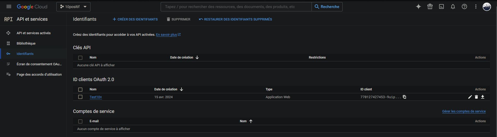
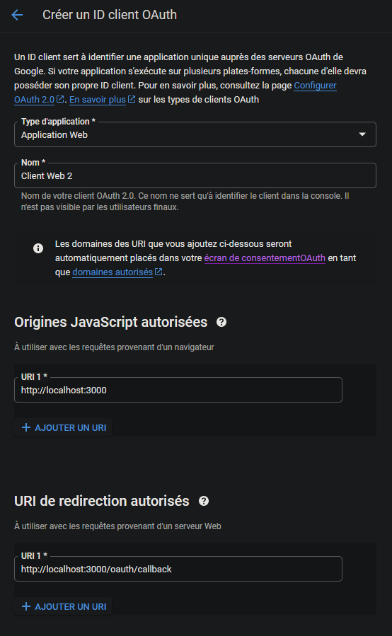
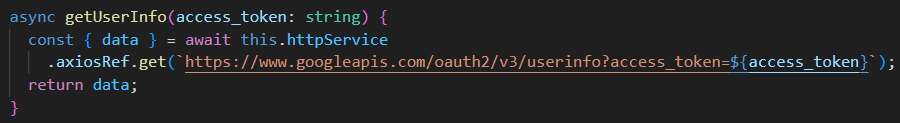

# OAuth 2.0 de Google

Google offre une API robuste qui permet d'accéder à divers services et fonctionnalités, tels que Google Drive, Gmail, Google Calendar, etc., en utilisant l'authentification OAuth 2.0.

Si vous avez des questions ou des problèmes, la [documentation de Google](https://developers.google.com/identity/protocols/oauth2) est bien documenté.

## Configuration

### Pré-requis

Avant de commencer à utiliser l'API de Google avec OAuth 2.0, assurez-vous de remplir les pré-requis suivants:
- Avoir un compte Google
- Créer ou rejoindre un projet dans la [Console Google Cloud](https://console.cloud.google.com/)


### Création d'un ID client OAuth 2.0

Pour obtenir un ID client OAuth 2.0, suivez ces étapes:

1. Accédez à la Console Google Cloud.
2. Sélectionnez votre projet.
3. Dans le menu de navigation, allez dans "APIs & Services" > "Credentials".

4. Cliquez sur "Create Credentials" et choisissez "OAuth Client ID".
5. Sélectionnez le type d'application (Web application, Android, iOS, etc.)

6. Configurer les origines et redirections autorisés de l'application. 

7. Récupérer le "Client ID" et le "Client Secret" pour l'implémentation.


### Consentement


1. Configuration des informations générales de votre projet

2. Configuration des informations développement de votre projet

3. Spécification des scopes (niveaux d'accès) que votre projet.

4. Ajout des utilisateurs de test pour vérifier le fonctionnement de l'authentification.


## Implémentation

Votre application nécessite le "Client ID" et "Client Secret" afin de manipuler avec les services de Google.

L'implémentation de l'OAuth 2.0 de Google est séparé en deux étapes distinctes:
1. Le consentement de l'utilisateur (authorization)
2. La confirmation du consentement

### Pré-requis

- Avoir le "Client ID" et le "Client Secret" de l'Api.
- Regarder l'[existance de librairie](https://developers.google.com/identity/protocols/oauth2/web-server#libraries) pour le language choisi.

### 1. Consentement de l'utilisateur

L'implémentation du consentement se résume à générer un lien avec les informations nécessaires (client_id, client_secret, scope, redirect_ui) pour diriger l'utilisateur sur la page du consentement.

Pour ce faire, deux solutions s'offrent à nous:
- Utiliser les librairies de Google afin de manipuler leur Api

- Faire les requêtes à la main
```bash
GET /authorize
Host: accounts.google.com
?response_type=code
&client_id=YOUR_CLIENT_ID
&redirect_uri=YOUR_REDIRECT_URI
&scope=YOUR_SCOPES
&state=YOUR_STATE
```

### 2. Confirmation du consentement

Une fois l'utilisateur autorisé, vous pouvez récupérer les tokens en échangeant le code d'autorisation avec Google. Voici un exemple de requête:
- Avec l'Api

- A la main:
```bash
POST /token
Host: oauth2.googleapis.com
Content-Type: application/x-www-form-urlencoded

client_id=YOUR_CLIENT_ID
&client_secret=YOUR_CLIENT_SECRET
&code=AUTHORIZATION_CODE
&grant_type=authorization_code
&redirect_uri=YOUR_REDIRECT_URI
```

### 3. Récupération des informations de l'utilisateur

Pour cela, vous avez besoin du scope `["email", "profile"]`.

- Avec Axios:

- A la main:
```bash
GET /userinfo/v2/me
Host: www.googleapis.com
Authorization: Bearer ACCESS_TOKEN
```